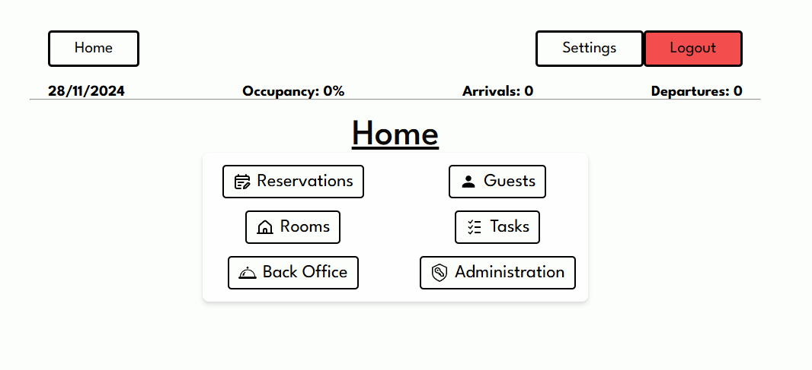

# Hotel Management Application

A modern, web-based hotel management application that streamlines hotel operations with a sleek and intuitive design. This application integrates guest and room management, reservations, and an innovative task queue system for improved communication across hotel departments.

---



## Features

### Core Functionalities
- **Guest Management**: Add, update, and manage guest profiles.
- **Room Management**: Manage rooms, room types, and their statuses.
- **System Users**: Manage system users with role-based access control.
- **Reservations**: Create, modify, and track room reservations and check reservations in and out.

### Task Queue System
- Assign tasks to specific hotel departments.
- Departments can follow up on tasks, mark them as complete, or transfer them to other departments.
- Enhances communication by centralizing task management and tracking within the same system.

### Modern Design
- Built with a sleek, modern UI that surpasses the outdated designs of traditional hotel management software.
- All icons sourced from [SVGRepo](https://www.svgrepo.com) (credit to SVGRepo).

---

## Tech Stack

### Frontend
- **Framework**: [React](https://reactjs.org/)
- **Bundler**: [Vite](https://vitejs.dev/)
- **Language**: TypeScript

### Backend
- **Framework**: [Express](https://expressjs.com/)
- **Runtime**: Node.js
- **Language**: TypeScript

---

## How to Run

### Using Docker
1. Ensure Docker is installed on your system.
2. In the project's root directory, run:
	```bash
	docker-compose up --build
	```
3. The server will be accessible at http://localhost:8000, and the client at http://localhost:3000.

### Using Node.js
1. Install dependencies for both frontend and backend:
	```bash
	cd frontend
	npm install
	cd ../backend
	npm install
	```
2. Start the development servers for both frontend and backend:
	```bash
	cd frontend
	npm run dev
	cd ../backend
	npm run dev
	```
3. The server will run at http://localhost:8000, and the client at http://localhost:5173.
